<div align="center">


# Mishi Glance

**Нативный просмотрщик изображений для macOS**

Открывает фото из Finder и листает стрелками всю папку — то, чего в macOS нет из коробки.

[](https://www.apple.com/macos/)
[](https://swift.org)
[]()
[]()
[]()
[](LICENSE)

[**⬇︎ Скачать Mishi Glance 1.6.0**](https://github.com/Coderok-ru/mishi_glance/releases/latest/download/Mishi.Glance.1.6.0.dmg)

</div>

---

## Зачем

В macOS двойной клик по фото открывает «Просмотр», и вы застреваете на одном файле: чтобы увидеть следующий, надо возвращаться в Finder. В Windows такой проблемы нет — там «Просмотр фотографий» листает всю папку стрелками.

Mishi Glance закрывает этот пробел. Открыли одно изображение — листаете всю папку. Стрелками, пробелом, свайпом по трекпаду.

<div align="center">
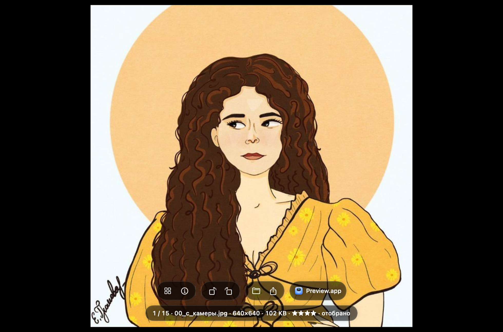
</div>

Интерфейс исчезает, когда не нужен: панель и индикатор скрываются через 2 секунды бездействия, остаётся только изображение на чёрном фоне.

---

## Возможности

### Навигация по папке

Открываете любой файл — приложение читает всю папку и строит список. Порядок совпадает с колонками Finder: имя (natural sort, где `img2` идёт перед `img10`), дата изменения, дата создания, дата добавления, размер, вид. Направление переключается.

| Действие | Клавиши |
|---|---|
| Следующее / предыдущее | `→` `←`, `Space` `⇧Space`, `PageDown` `PageUp` |
| Первое / последнее | `Home` / `End` |
| Листание трекпадом | свайп двумя пальцами влево / вправо |

Папка отслеживается вживую: добавили файл в Finder — он появится в списке, удалили — исчезнет, а курсор останется на месте.

### Список файлов

Отдельное окно со всеми изображениями папки — списком или сеткой.

<div align="center">
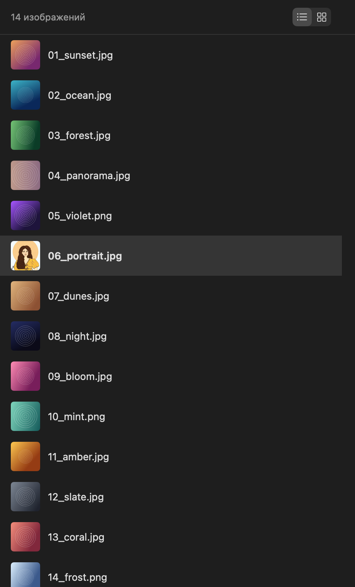
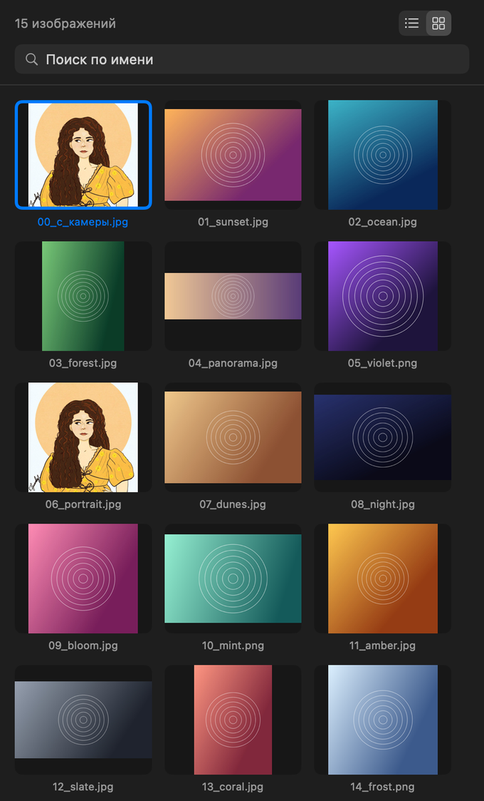
</div>

Поиск по имени фильтрует список на лету — в папке на тысячу файлов это заметно
экономит время. Миниатюры держатся в собственном кеше, поэтому просмотр большой
папки не вытесняет из памяти кадры, которые показывает просмотрщик.

### Масштаб и поворот

| Действие | Клавиши |
|---|---|
| Вписать в окно | `⌘0` |
| Реальный размер | `⌘1`, двойной клик |
| Увеличить / уменьшить | `⌘+` / `⌘−`, `⌘`+колесо, пинч на трекпаде |
| Повернуть вправо / влево | `⌘R` / `⌘L` |
| Во весь экран | `F` или `⌃⌘F`, выход — `Esc` |

Панорамирование — перетаскиванием, когда изображение больше окна. Учитывается EXIF-ориентация. Поворот только для просмотра, файл не меняется.

### Работа с файлом

| Действие | Клавиши |
|---|---|
| Показать в Finder | `⇧⌘R` |
| Открыть в редакторе | `⌘E` |
| Копировать изображение | `⌘C` |
| В Корзину | `⌘⌫` |
| Панель информации (EXIF) | `⌘I` |
| Список файлов папки | `⌘B` |
| Шпаргалка по клавишам | `?` или `⌘/` |
| Слайдшоу | `S` |
| Пипетка цвета | `⌥⌘C` |
| Напечатать | `⌘P` |
| Экспорт и конвертация | `⇧⌘E` |
| Сравнить со следующим | `⌘\` |
| Отобрать / отклонить / снять | `P` / `X` / `U` |
| Рейтинг | `0`…`5` |
| Проверить обновления | меню программы |
| Поделиться | меню «Файл» |

<div align="center">
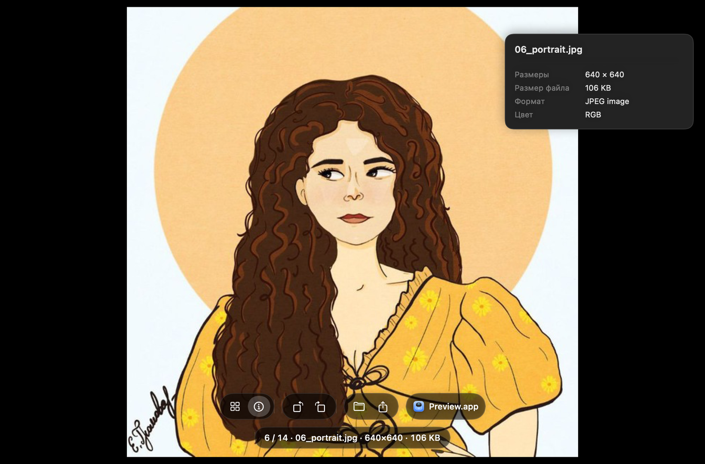
</div>

Панель показывает всё, что есть в файле: имя и папку, размер, формат, глубину цвета,
альфа-канал, цветовой профиль и ориентацию. Ниже — гистограмма с переключением каналов
RGB / L / R / G / B и средними по каждому. Затем камера, объектив, программа обработки,
выдержка, диафрагма, ISO, фокусное расстояние, экспокоррекция, режим съёмки, замер,
вспышка и баланс белого. Если камера записала координаты — карта места съёмки
с кнопкой «Открыть в Картах».

### Знакомство и шпаргалка

При первом запуске приложение коротко объясняет главное и предлагает назначить
себя программой по умолчанию. Полный список клавиш открывается в любой момент —
клавишей `?` или через меню «Справка».

<div align="center">
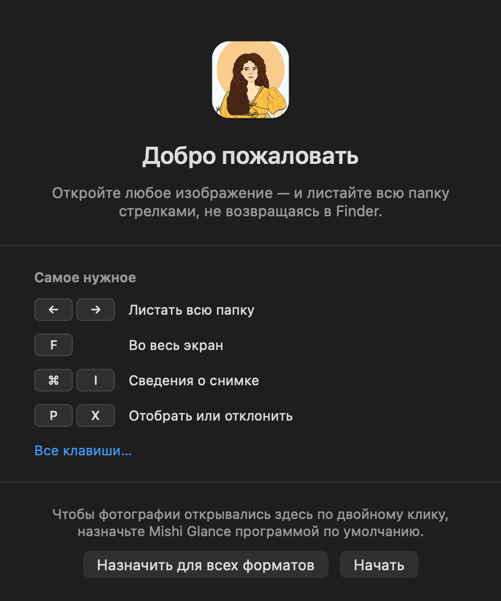
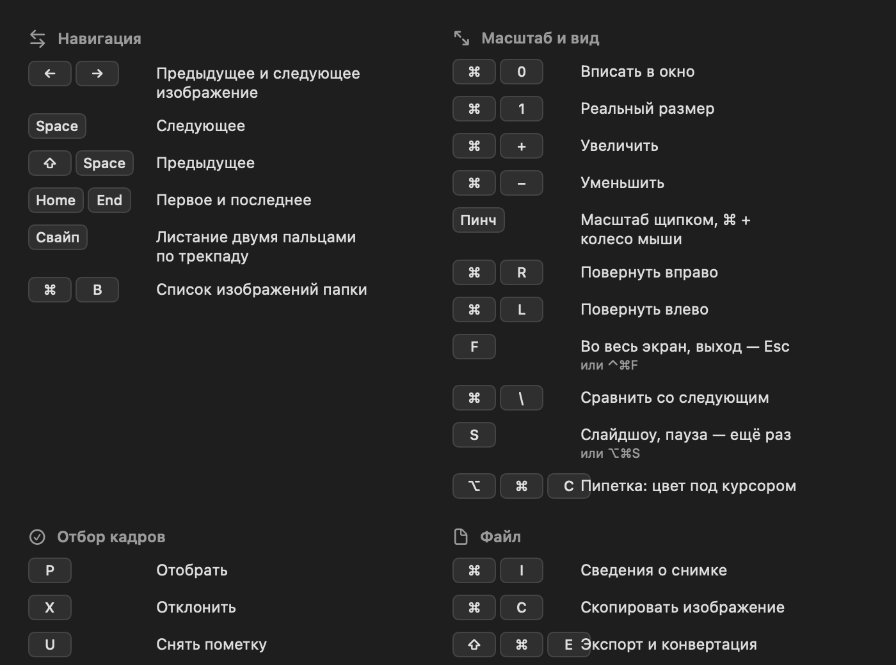
</div>

### Инструменты для папки

**Поиск повторов** находит не только точные копии, но и пережатые или уменьшенные
версии того же кадра — сравнение идёт по перцептивному хешу, а не по содержимому
файла. Показывает, сколько места освободится, и оставляет в каждой группе
самый крупный файл.

**Пакетное переименование** по шаблону: `{дата}`, `{время}`, `{камера}`, `{имя}`
и номера `{n}`, `{nn}`, `{nnn}`. Превью показывает старое и новое имя рядом
и подсвечивает конфликты до того, как что-то изменится.

<div align="center">
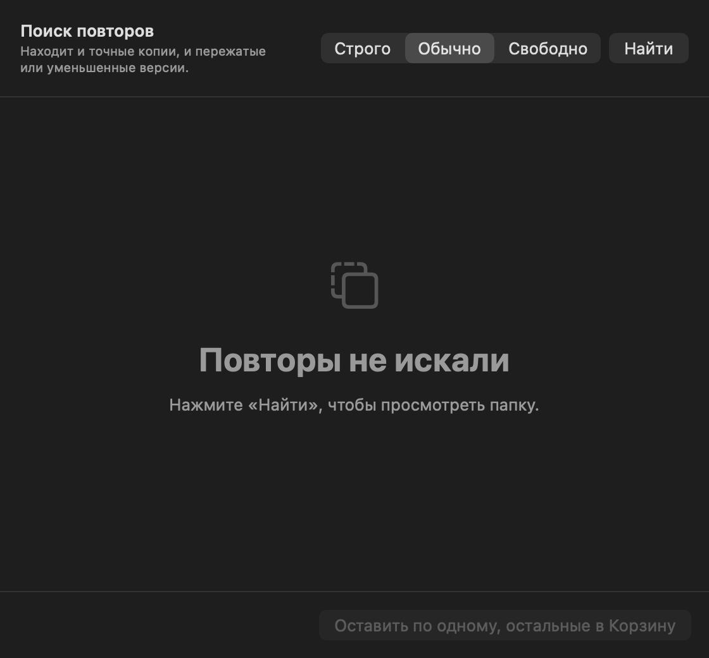
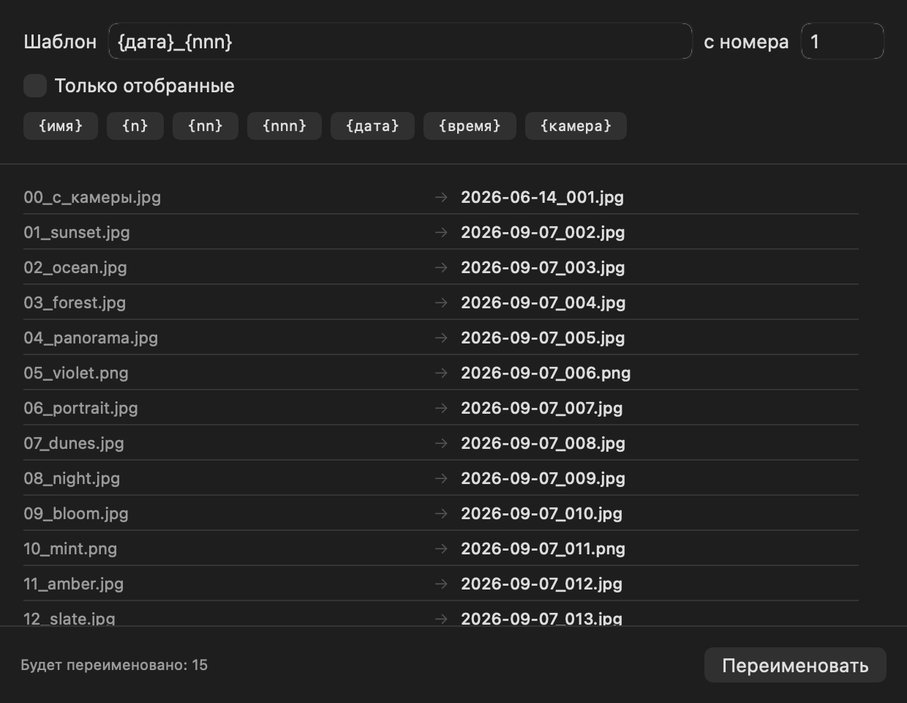
</div>

### Слайдшоу, печать и пипетка

`S` или кнопка на панели запускают автолистание с настраиваемой паузой и плавной
сменой кадров: уходящий снимок гаснет, пока проявляется следующий. Переход
можно отключить в настройках. Дальше — `⌘P` печатает снимок вписанным в страницу, `⌥⌘C` включает пипетку: цвет под курсором показывается
в HEX и RGB, клик копирует его в буфер.

### Отбраковка

Приехали с сотней кадров — надо отобрать десяток. `P` отмечает удачный снимок,
`X` отклоняет, цифры `0`…`5` ставят рейтинг. Потом одним действием: «Переместить
отобранные…» раскладывает их в выбранную папку, «Отклонённые в Корзину…» убирает
лишнее.

Пометки хранятся в расширенных атрибутах файла, а не внутри снимка — сами
фотографии не переписываются. Рейтинг пишется в стандартный ключ Spotlight,
поэтому его видят Finder и поиск.

### Сравнение двух кадров

`⌘\` ставит рядом текущий и следующий снимок с общим масштабом и
панорамированием. Чтобы выбрать из двух почти одинаковых, где резче глаз.

Кроме показа рядом есть наложение с ползунком прозрачности и режим разницы —
подсвечивает ровно то, что изменилось между двумя версиями.

<div align="center">
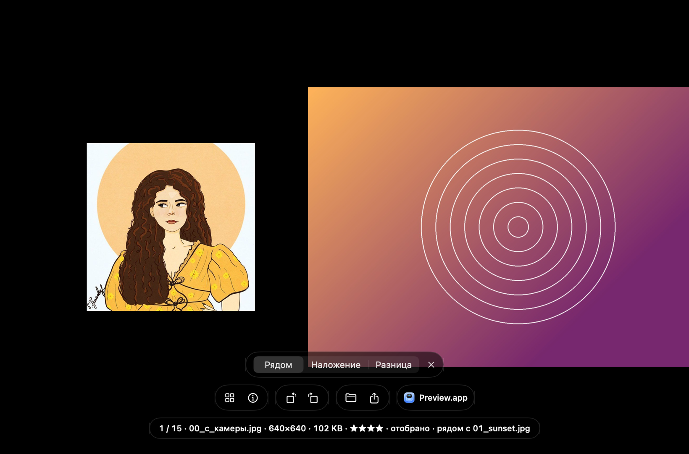
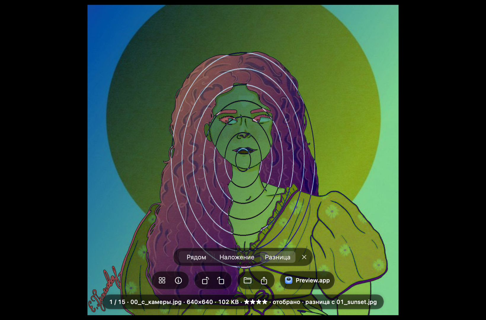
</div>

### Экспорт и конвертация

`⇧⌘E` пересохраняет в JPEG, PNG, HEIC или TIFF — один снимок, всю папку или
только отобранные. С качеством, необязательным уменьшением длинной стороны и
переносом EXIF, геометки и авторства. Главный сценарий — HEIC с айфона в JPEG,
который открывается везде.

<div align="center">
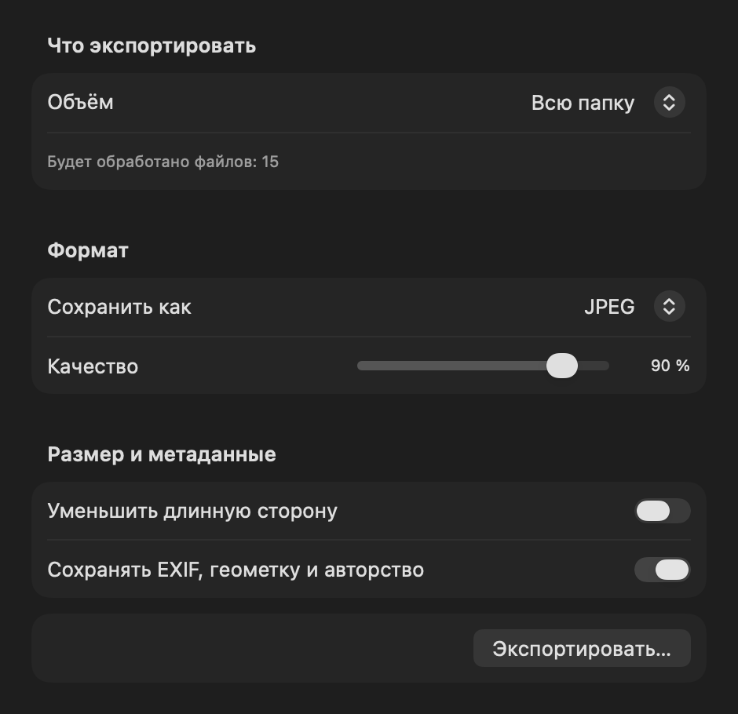
</div>

### Анимация и Live Photos

Анимированные GIF, APNG и WebP проигрываются целиком, а не первым кадром.
Live Photo оживает по клику: приложение находит рядом парный ролик.

---

## Программа по умолчанию

Главная причина, по которой такое приложение вообще нужно, — чтобы двойной клик в Finder открывал именно его. Назначается в один клик, по каждому формату отдельно или всё сразу.

<div align="center">
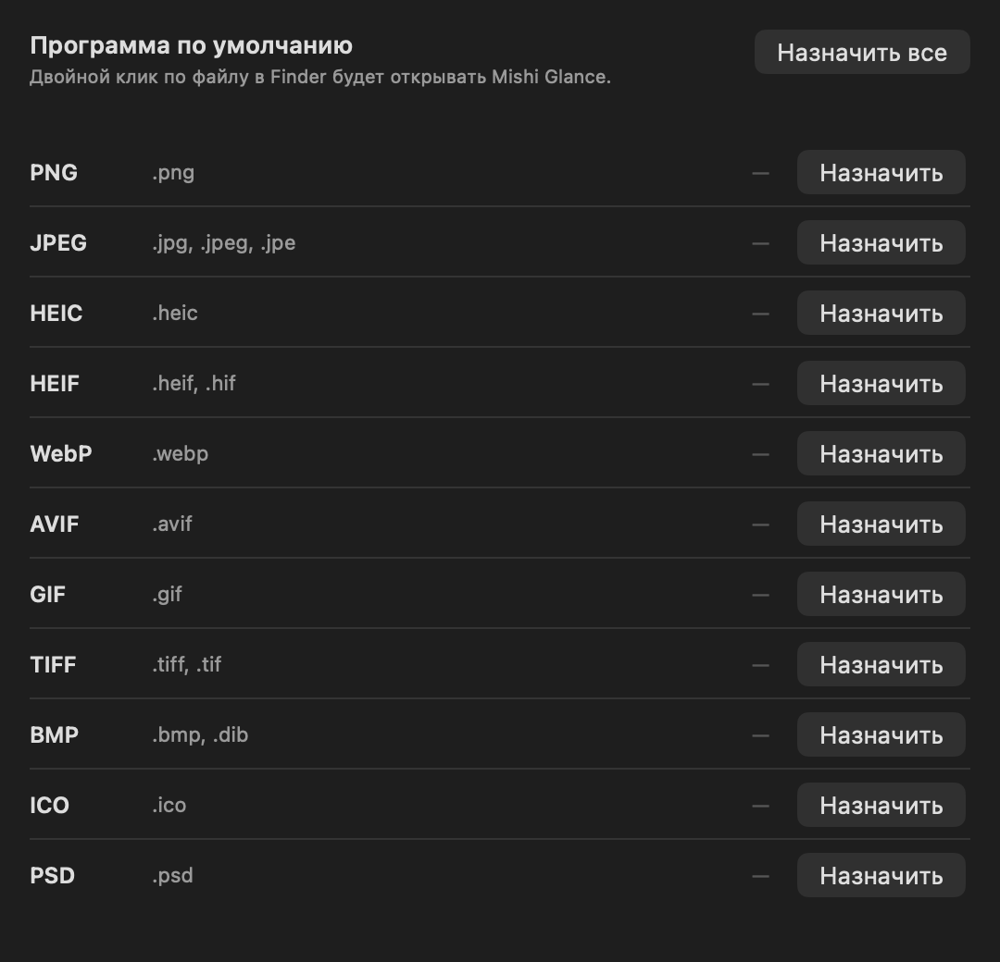
</div>

Приложение добавляет два пункта в контекстное меню Finder: «Открыть в Mishi Glance»
и «Конвертировать в JPEG» — второй работает, даже когда программа закрыта.
Несколько папок открываются вкладками в одном окне.

**Поддерживаются:** JPEG, PNG, HEIC, HEIF, WebP, AVIF, GIF (первый кадр), TIFF, BMP, ICO, PSD,
а также **RAW** — DNG, Canon CR2/CR3, Nikon NEF, Sony ARW, Fujifilm RAF, Olympus ORF,
Panasonic RW2. Всего macOS декодирует 30 RAW-форматов, и все они открываются.

**SVG** открывается как вектор: изображение растрируется под текущий масштаб,
поэтому остаётся чётким при увеличении, а не размывается.

### Автообновление

Приложение раз в сутки спрашивает GitHub Releases о новых версиях, а по пункту
меню «Проверить обновления…» — в любой момент. Найдя новую, показывает список
изменений и по кнопке скачивает образ, проверяет его и заменяет себя, после чего
перезапускается.

Перед установкой скачанное проверяется по подписи: `codesign` должен подтвердить
целостность, отдать Team ID `FKD7Y4FR88`, подпись Developer ID и hardened runtime.
Не сошлось — установка не начинается. Без этой проверки автообновление стало бы
каналом подмены приложения.

Sparkle не используется: ТЗ запрещает внешние зависимости, а нужное умещается
в два файла поверх Releases API. Автопроверку можно выключить в настройках.

---

## Настройки

<div align="center">
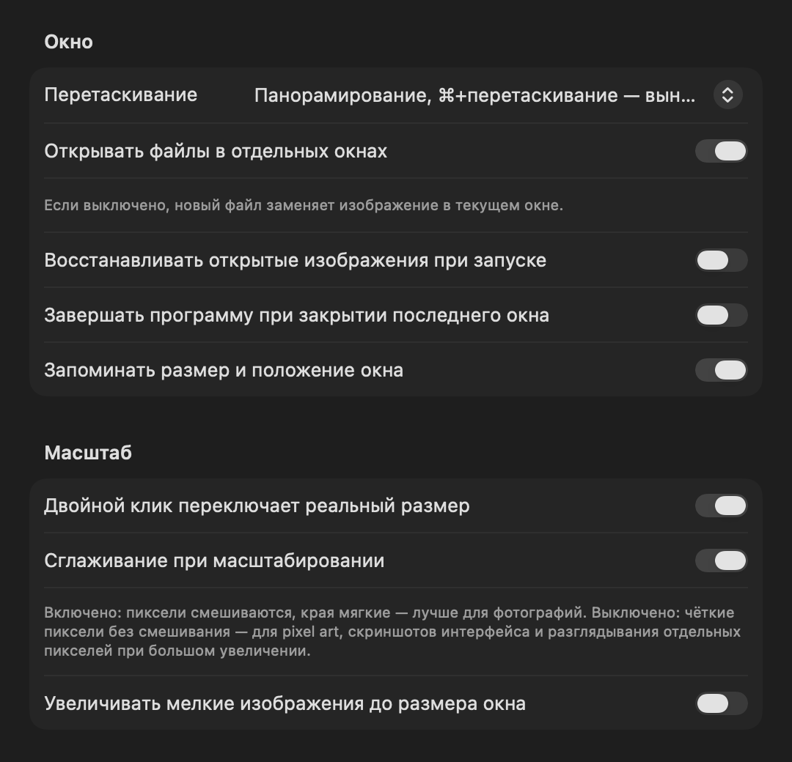
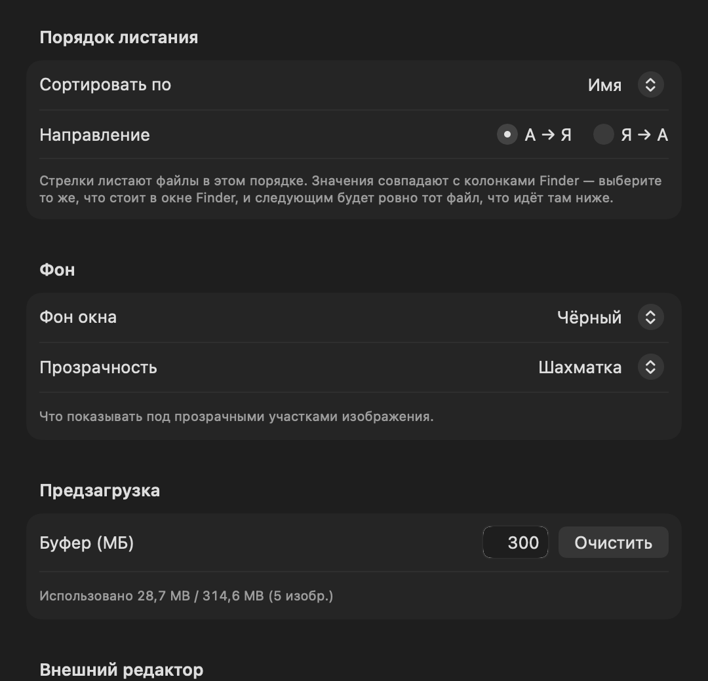
</div>

**Общие** — автообновление, поведение перетаскивания (панорамирование или вынос файла в другую программу), отдельные окна для файлов, восстановление сессии при запуске, завершение при закрытии последнего окна, двойной клик для реального размера, сглаживание при масштабировании, свайпы, циклическая навигация, подтверждение удаления.

**Просмотр** — порядок листания и направление, фон окна, что показывать под прозрачными участками (шахматка, цвет фона, белый, чёрный), размер буфера предзагрузки с показом расхода и кнопкой очистки, выбор внешнего редактора.

Сглаживание стоит выключить для pixel art и скриншотов интерфейса: тогда пиксели остаются чёткими при увеличении, без размытия.

---

## Производительность

Декодирование идёт через `CGImageSource` с ограничением по размеру экрана — полное разрешение подгружается только при увеличении сверх «вписать в окно». Соседние кадры (±2) греются в фоне, кеш ограничен настраиваемым бюджетом.

| Показатель | Значение |
|---|---|
| Открытие файла до первого кадра | ~30 мс (JPEG 12 Мп, M-серия) |
| Переход к соседнему кадру | из кеша, мгновенно |
| Размер приложения | 3 МБ |
| Кеш по умолчанию | 300 МБ, настраивается 64–8192 МБ |

Список папки читается асинхронно — папка на тысячи файлов не блокирует интерфейс.

---

## Установка

Скачайте [последний релиз](https://github.com/Coderok-ru/mishi_glance/releases/latest), откройте образ и перетащите приложение в «Программы».

<div align="center">
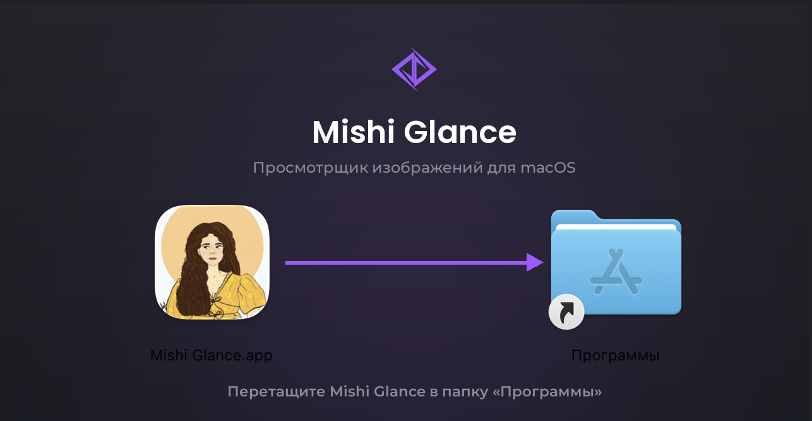
</div>

Приложение подписано сертификатом Developer ID и **заверено у Apple**, поэтому открывается обычным двойным кликом — без предупреждений и обходных путей. Штамп нотаризации прикреплён и к образу, и к самому приложению, так что проверка проходит даже без интернета.

**Требования:** macOS 15 Sequoia и новее. Universal binary — работает нативно и на Apple Silicon, и на Intel.

---

## Сборка из исходников

```bash
git clone https://github.com/Coderok-ru/mishi_glance.git
cd mishi_glance
xcodebuild -project "Mishi Glance.xcodeproj" -scheme "Mishi Glance" \
           -configuration Release -destination 'generic/platform=macOS' build
```

### Сборка установщика

```bash
./scripts/make-dmg.sh                  # собрать тем, что есть в связке ключей
./scripts/make-dmg.sh --create-cert    # разрешить Xcode выпустить Developer ID
./scripts/make-dmg.sh --notarize       # собрать, отправить в Apple, прикрепить штамп
```

Скрипт архивирует проект, экспортирует с Developer ID (это снимает отладочный
`com.apple.security.get-task-allow`, с которым Apple отклоняет нотаризацию),
рисует фон в фирменных цветах, собирает образ и подписывает его.

Учётные данные для нотаризации сохраняются один раз в связку ключей:

```bash
xcrun notarytool store-credentials mishi-notary \
    --apple-id ВАШ@APPLE.ID --team-id TEAMID --password APP-SPECIFIC-PASSWORD
```

---

## Архитектура

```
Mishi Glance/
├─ App/
│  ├─ main.swift                  явный bootstrap AppKit
│  ├─ AppDelegate.swift           открытие файлов, окна, главное меню
│  ├─ ViewerWindowController.swift окно просмотра, клавиатура, fullscreen
│  └─ BrowserWindowController.swift окно списка файлов
├─ Model/
│  ├─ FolderModel.swift           список папки, курсор, сортировка, FSEvents
│  ├─ ImageLoader.swift           actor: кеш декодирования, префетч, LRU
│  ├─ ImageDecoder.swift          CGImageSource, EXIF, метаданные
│  ├─ ImageEntry.swift            файл и его атрибуты
│  ├─ ViewerController.swift      состояние просмотра, действия с файлом
│  └─ FileAssociations.swift      программа по умолчанию
├─ Views/
│  ├─ ImageCanvasView.swift       AppKit-канва: zoom, pan, жесты, прозрачность
│  ├─ ViewerView.swift            SwiftUI-обвязка, overlay, drag & drop
│  ├─ ViewerToolbar.swift         плавающая панель
│  ├─ BrowserView.swift           список и сетка
│  ├─ InfoPanelView.swift         EXIF-панель
│  ├─ AboutView.swift             о программе
│  └─ Settings/                   три вкладки настроек
└─ Support/AppSettings.swift      UserDefaults
```

SwiftUI везде, где его хватает. AppKit — там, где нет: окно и fullscreen,
перехват клавиш до того, как их проглотит SwiftUI, и канва изображения, где
нужны точная геометрия слоёв, пинч, `⌘`+колесо и свайпы трекпада.

`FolderModel` и `ViewerController` — `@Observable`, по одному на окно.
`ImageLoader` — actor, общий для всех окон, гарантирует один декод на файл.
Бизнес-логики во view нет.

**Зависимости:** нет. Только системные фреймворки.

---

## Тесты

Два набора проверок на реальном коде — модельный и интеграционный, суммарно 89 проверок:
natural sort против системного компаратора Finder, навигация и цикличность,
все критерии сортировки, слежение за папкой (файл добавили и удалили снаружи),
математика zoom/pan/rotate с ограничением по краю, кеш и его бюджет,
декодирование и EXIF, битый файл, размеры и форма окон, файловые ассоциации.

---

## Лицензия

Исходный код распространяется по [MIT](LICENSE) — берите, меняйте, встраивайте
в свои проекты, в том числе коммерческие. Единственное условие: сохраните текст
лицензии с указанием авторства.

Лицензия покрывает **код**. Отдельно:

- **иконка приложения** — художественная работа, права на неё не передаются вместе с кодом;
- **шрифты** Poppins и Montserrat в `scripts/assets/` — SIL Open Font License 1.1,
  подробности в [FONTS.md](scripts/assets/FONTS.md). Нужны только для отрисовки
  фона установщика, в приложение не входят.

---

## Об авторе

<table>
<tr>
<td>

**Андрей Любиченко**
Разработчик, студия [Coderok](https://coderok.ru)

Сайты, мобильные приложения и CRM — от идеи до продакшена.
11 лет в коммерческой разработке, Санкт-Петербург.

</td>
<td>

[](https://t.me/coderok_official)
[](https://coderok.ru)
[](mailto:info@coderok.ru)

</td>
</tr>
</table>

<div align="center">
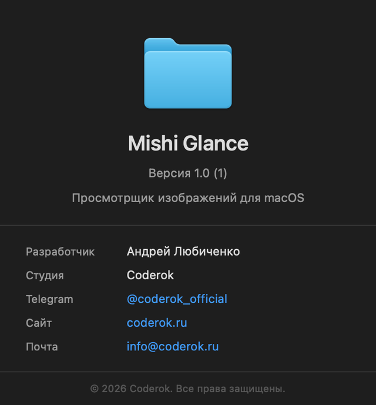
</div>

---

<div align="center">
<sub>© 2026 Coderok · Андрей Любиченко · <a href="LICENSE">MIT</a></sub>
</div>
